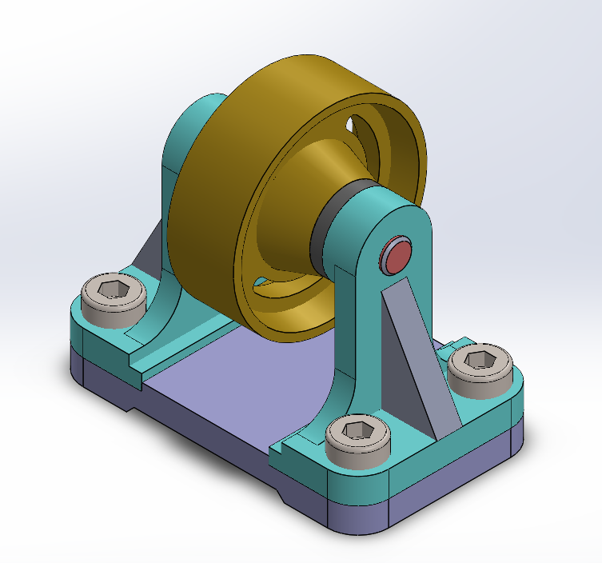
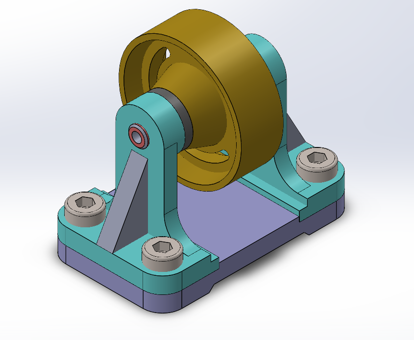
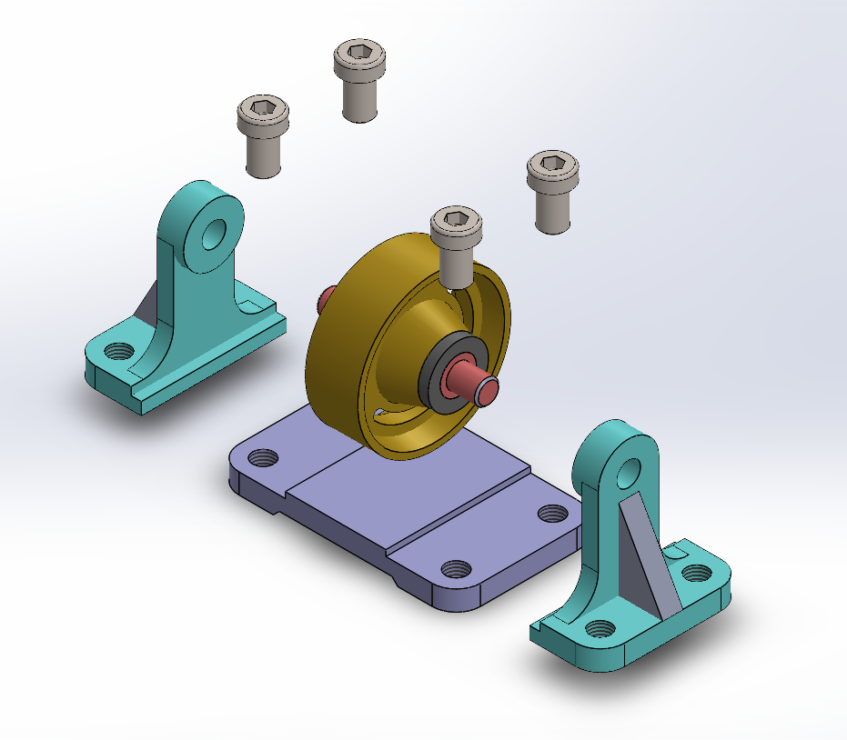

# Assembly-Model-2-SW

Belt Roller Support Assembly

---

Project Overview

This repository contains the SolidWorks assembly model of a Belt Roller Support, showcasing the mechanical design and structural support for conveyor systems. This component plays a crucial role in ensuring smooth and reliable belt motion by minimizing friction and securely supporting the conveyor belt load. The design emphasizes both durability and ease of manufacturing.

Key Features

Robust Support Structure — Designed to handle substantial loads in industrial conveyor applications.

Optimized Geometry — Ensures uniform belt contact and reduced wear.

Exploded View Visualizations — Provides clear understanding of part relationships and assembly sequence.

CAD Files Included — Editable SolidWorks files for customization and improvement.

Applications

This Belt Roller Support is commonly used in:

>Conveyor belt systems in manufacturing plants

>Material handling industries

>Bulk goods transportation setups

>Packaging and distribution centers

Assembly Demo Video

▶ Watch the Assembly Demonstration

Author-

Nishchay Sharma

>B.Tech Mechanical Engineering

>Gold Medalist | Design Engineer

## File Include-
- 'project02_nishchay.  SLDPRT' -
solidworks part file

## License
This project is licensed under the MIT license.

### Isometric View 1

### Isometric View 2

### Exploded View

Thank You for Viewing!