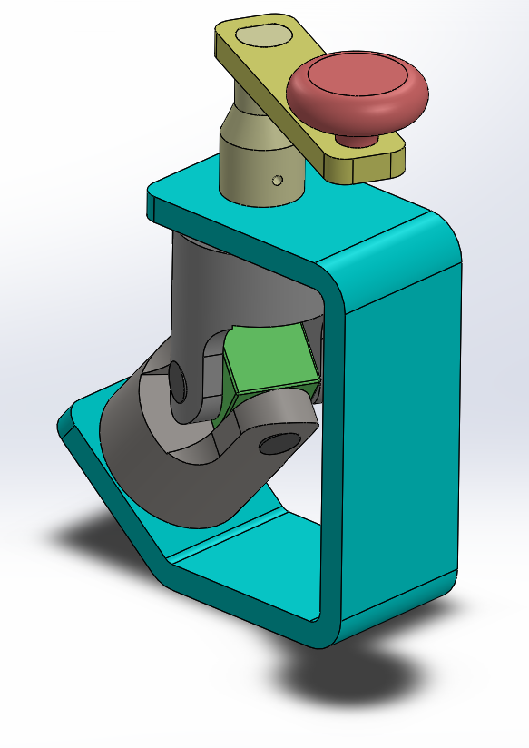
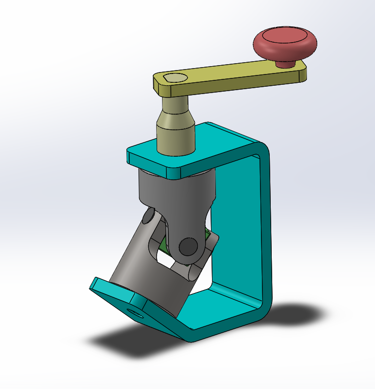
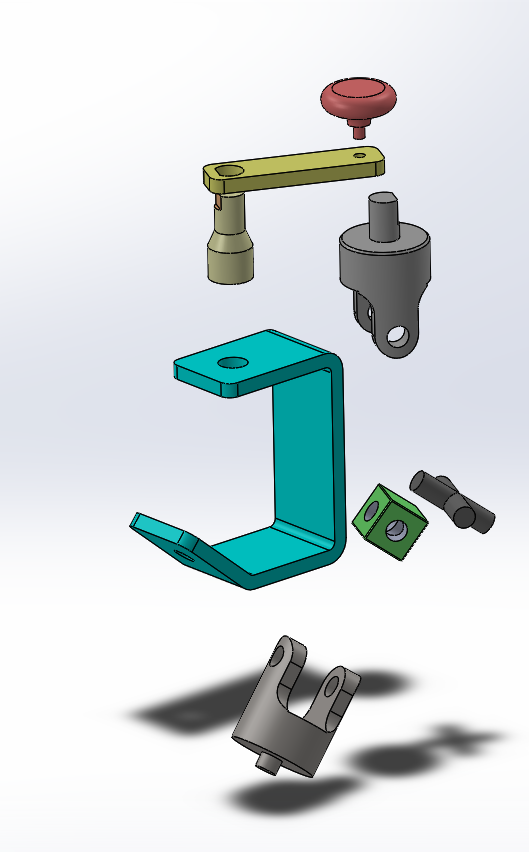

# Assembly-Model-3-SW

## Universal Coupling Assembly | SolidWorks CAD Model

This repository contains a detailed Universal Coupling Assembly designed using SolidWorks. The model demonstrates how rotational motion is transmitted between two shafts at an angle, commonly used in automotive and industrial applications.

##Features

Parametric 3D CAD Model

Fully Constrained Assembly with realistic mates

Detailed Components including yokes, pins, and shaft connections

Accurate Mechanical Representation of angular motion transfer

## Preview

## Applications

Automotive drive shafts

Industrial machinery

Robotics joints

Mechanical transmission systems

## Author

Nishchay Sharma

>B.Tech Mechanical Engineering

>Gold Medalist | Design Engineer

## File Include-
- 'project03_nishchay.  SLDPRT' -
solidworks part file

## License
This project is licensed under the MIT license.

### Isometric View 1

### Isometric View 2

### Exploded View

Thank You for Viewing!