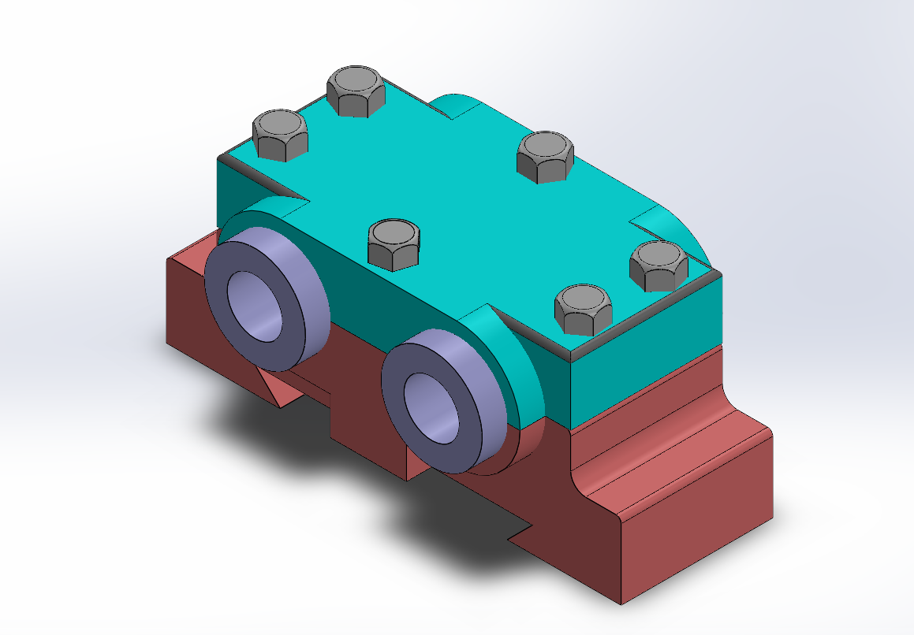
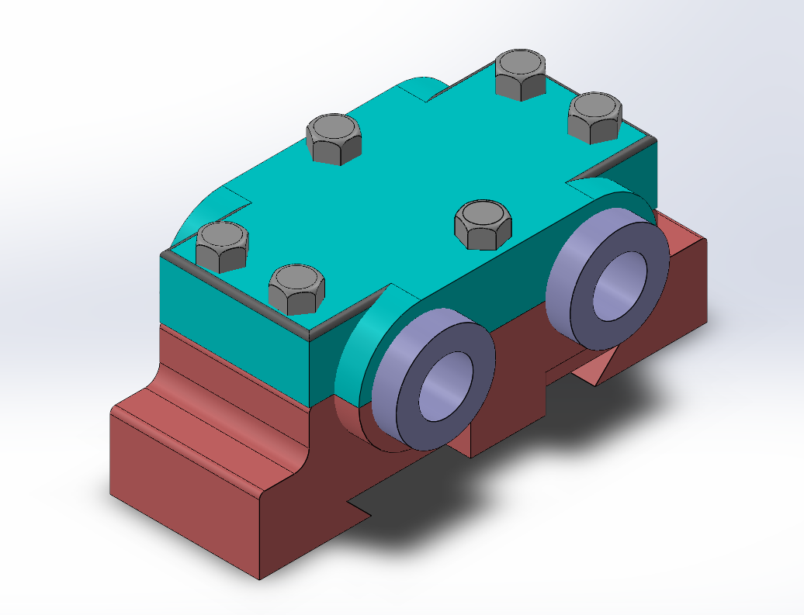
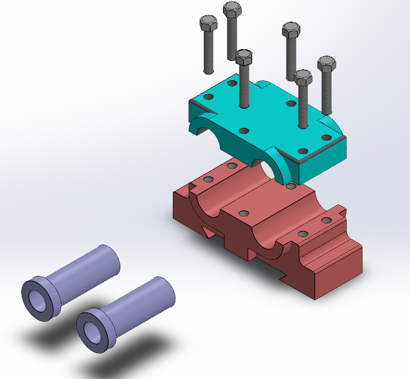

# Assembly-Model-4-SW

# Double Bearing Assembly – SolidWorks Project

This repository contains the complete SolidWorks model of a *Double Bearing Assembly*, designed to securely house and support two parallel bearings for shaft applications.

## Assembly Description

The Double Bearing Assembly is a precision mechanical component used to mount and align rotating shafts at two points. This design improves load distribution, minimizes deflection, and ensures smooth operation in mechanical systems.

## Features

- *Two Cylindrical Bearings* housed securely in the assembly

- *Split Housing Design* with bolted top cover and bottom block 
 
- *Six Hex Bolts* for rigid assembly and easy maintenance  

- Suitable for applications involving *parallel shaft support*

## Components

- Bearing Housing (Bottom Block)

- Top Cover Plate

- 2 Bearings

- 6 Hex Bolts & Nuts

## Design Specifications

- Modeled using SolidWorks 2023 

- Assembly includes fully mated components  

- Features used: Extrude, Cut-Extrude, Fillet, Hole Wizard, Assembly Mates

## Preview

## Author

Nishchay Sharma

>B.Tech Mechanical Engineering

>Gold Medalist | Design Engineer

## File Include-
- 'project04_nishchay.  SLDPRT' -
solidworks part file

## License
This project is licensed under the MIT license.

### Isometric View 1

### Isometric View 2

### Exploded View

Thank You for Viewing!