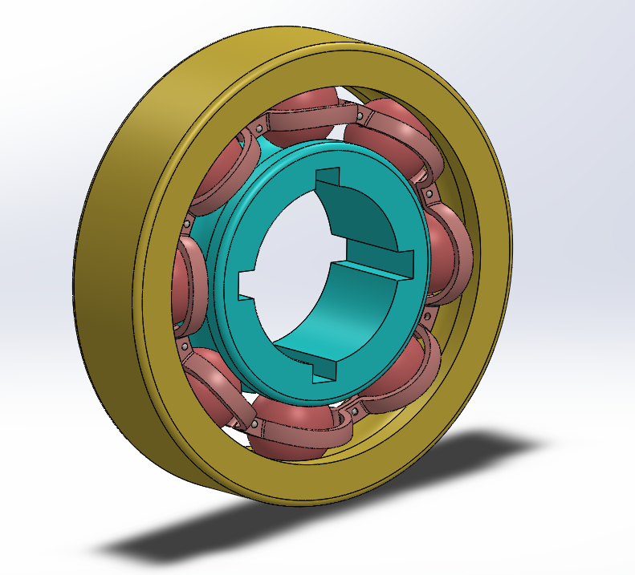
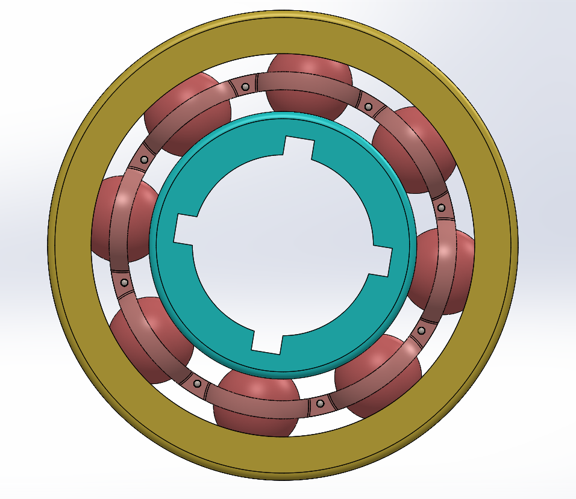
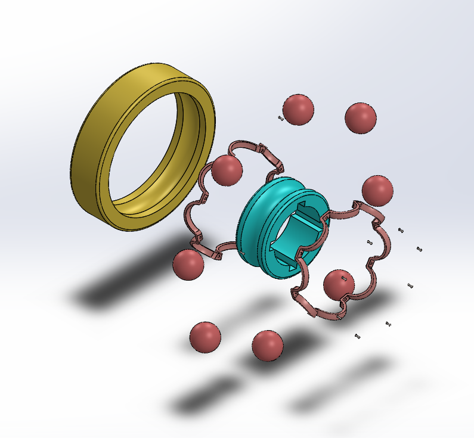

# Assembly-Model-5-SW

# Ball Bearing | SolidWorks Design

A precise 3D model of a *Ball Bearing*, designed in SolidWorks, showcasing the essential mechanical component widely used to reduce rotational friction and support radial and axial loads.

## 📌 Key Features

- Detailed modeling of *inner ring, **outer ring, **balls, and **cage (retainer)*

- Suitable for demonstrating basic bearing assembly and mechanical applications

- Designed with real-world proportions for educational and prototyping use

## ⚙ Application Overview

Ball bearings are fundamental machine elements used to:

- Reduce friction between moving parts

- Support radial and axial loads in rotating machinery

- Improve efficiency in mechanical systems like motors, gearboxes, and turbines

## 🛠 Components Modeled

- *Inner Ring*

- *Outer Ring*

- *Spherical Balls*

- *Cage (Retainer)*

## 🎥 Assembly Demonstration

## Author

Nishchay Sharma

>B.Tech Mechanical Engineering

>Gold Medalist | Design Engineer

## File Include-
- 'project05_nishchay.  SLDPRT' -
solidworks part file

## License
This project is licensed under the MIT license.

### Isometric View 

### Front View

### Exploded View

Thank You for Viewing!