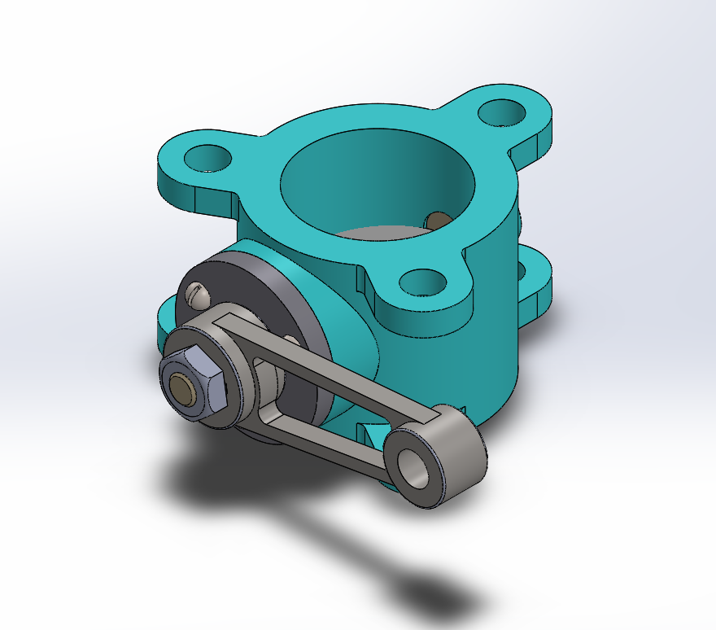
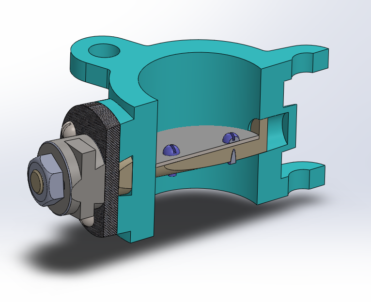
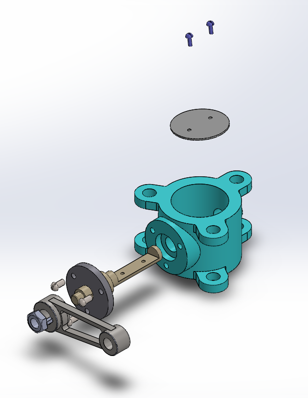

# Assembly-Model-6-SW

# Butterfly Valve | SolidWorks Model

A parametric 3D model of an industrial *Butterfly Valve*, designed in SolidWorks. This project demonstrates precise modeling of valve components commonly used in fluid control systems, featuring an operable disc, body, and handle mechanism.

## Features

- Fully modeled *butterfly valve* assembly

- Includes disc, valve body, handle, and fasteners

- Suitable for educational, demonstration, and simulation purposes

- Parametric and dimension-driven design

## Preview

## Author

Nishchay Sharma

>B.Tech Mechanical Engineering

>Gold Medalist | Design Engineer

## File Include-
- 'project06_nishchay.  SLDPRT' -
solidworks part file

## License
This project is licensed under the MIT license.

### Isometric View 

### Section View

### Exploded View

Thank You for Viewing!