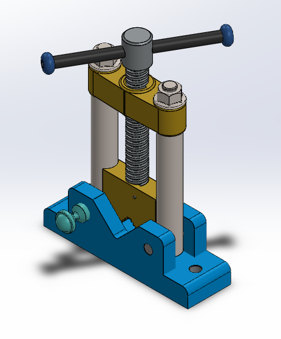
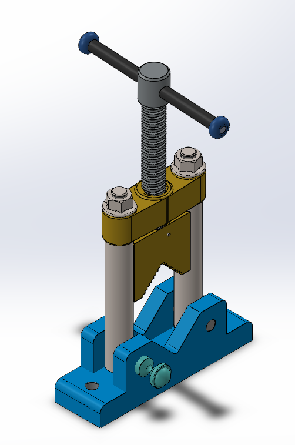
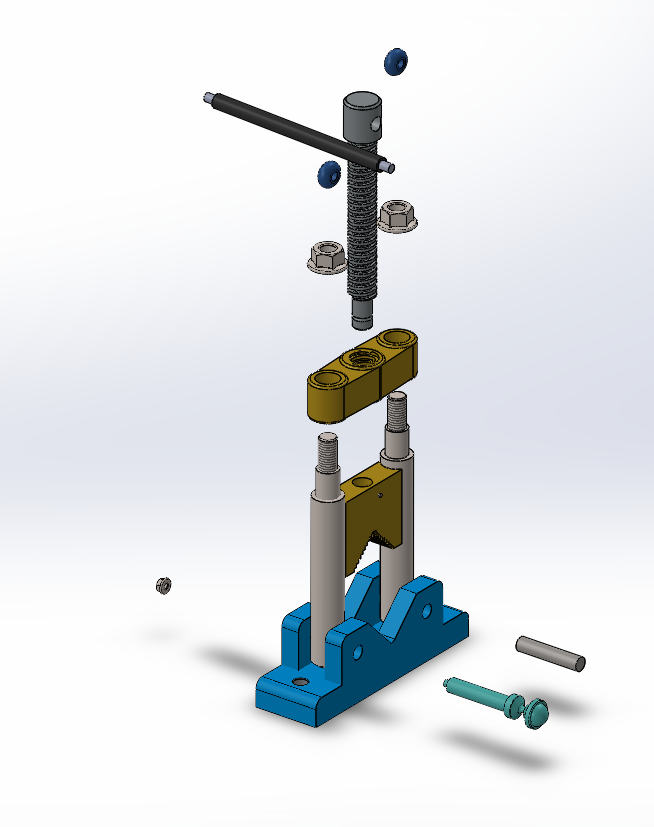

# Assembly-Model-7-SW

# Mechanical Assembly - Vise Clamp Model

## Overview

This project showcases a *3D CAD model of a Vise Clamp, developed using **SolidWorks*. The design demonstrates basic mechanical assembly principles including fasteners, threaded components, and movable parts for clamping applications.

## Preview

## Features

- *Threaded Shaft Mechanism* for vertical motion  

- *Adjustable Clamping Arms*  

- *Bolted Joints* for modular assembly  

- *Base Plate with Supports* for stability  

- Fully Defined Sketch

## Applications

This model is suitable for:

- Educational demonstrations of screw-based clamping 
 
- Prototyping vise designs  

- Basic mechanical motion studies  

## Author

Nishchay Sharma

>B.Tech Mechanical Engineering

>Gold Medalist | Design Engineer

## File Include-
- 'project07_nishchay.  SLDPRT' -
solidworks part file

## License
This project is licensed under the MIT license.

### Isometric View 1 

### Isometric View 2

### Exploded View

Thank You for Viewing!