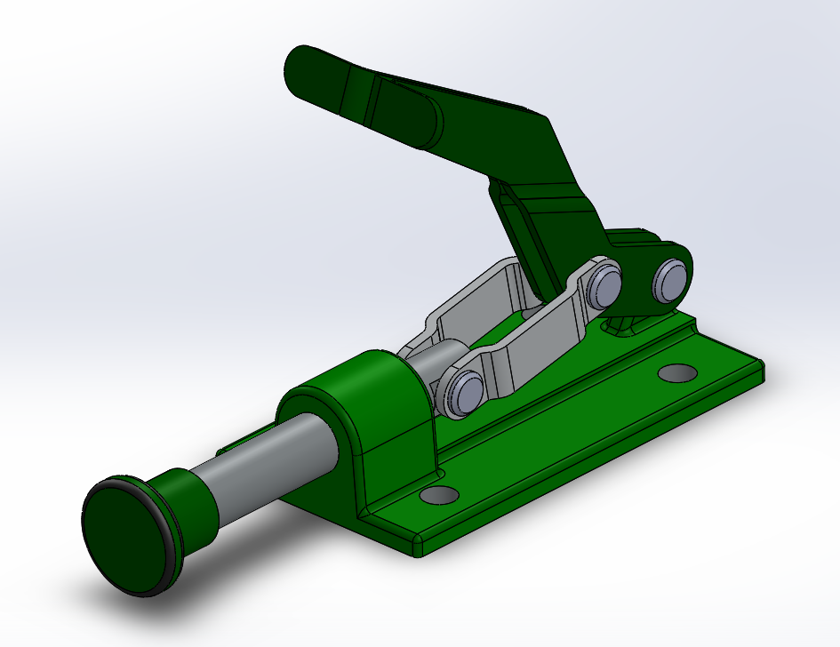
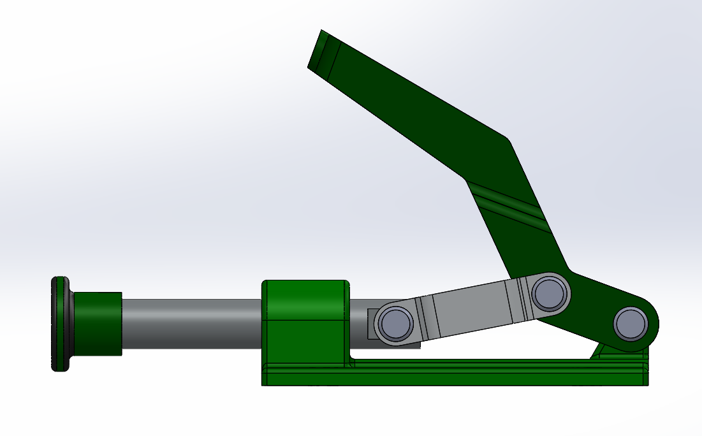
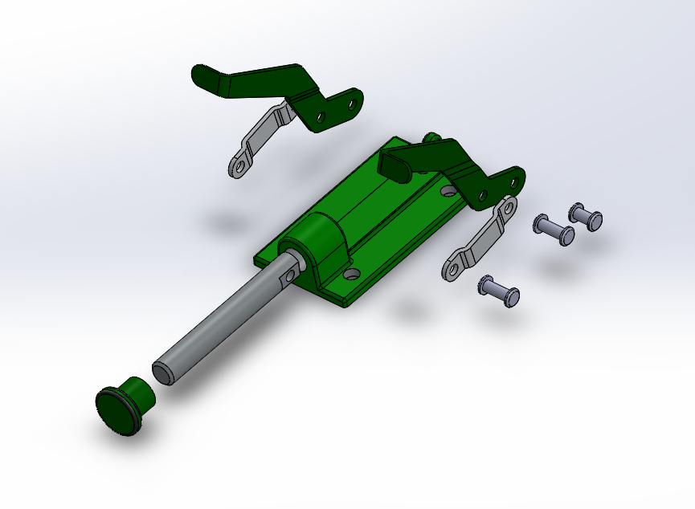

# Assembly-Model-8-SW

# Toggle Clamp Assembly - SolidWorks Model

This repository features a detailed 3D model of a *Toggle Clamp Assembly*, created in SolidWorks. Toggle clamps are commonly used in jigs and fixtures to securely hold workpieces during machining, welding, or inspection operations.

## Preview

## Key Features

- Fully assembled toggle clamp model

- Includes all major components: handle, base, linkage arms, and clamping pad

- Realistic mechanical motion simulation supported

- Designed with manufacturing feasibility in mind

## Files Included

- toggle-clamp-assembly.SLDASM – Assembly file  

- toggle-clamp.png – Rendered image of the assembly

## Applications

- Workholding in CNC machining or fabrication

- Welding fixtures

- Inspection jigs

- General clamping mechanisms

## Author

Nishchay Sharma

>B.Tech Mechanical Engineering

>Gold Medalist | Design Engineer

## File Include-
- 'project08_nishchay.  SLDPRT' -
solidworks part file

## License
This project is licensed under the MIT license.

### Isometric View  

### Side View

### Exploded View

Thank You for Viewing!