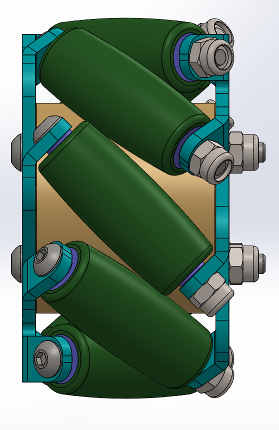

# Assembly-Model-9-SW

# Mecanum Wheel Assembly Project

This project demonstrates the 3D design, modeling, and assembly of a **Mecanum Wheel**, a type of omnidirectional wheel commonly used in robotics and automation. The design was created using CAD software and is suitable for educational, prototyping, and robotics applications.

## 📹 Preview

Watch the project in action here: 
 
👉 [YouTube Video](https://youtube.com/shorts/zlhjGXNq9XA?si=7qXwYaYVh6BTUbCg)

## 🛠️ Features

- Complete 3D model of a Mecanum Wheel

- Step-by-step assembly process

- Suitable for 3D printing and practical applications

- Ideal for robotics, mechanical engineering, and design learning

## 📁 Project Structure

## 🔍 Applications

- Robotics and automation projects

- Educational demonstrations

- Mobile platforms requiring omnidirectional movement

## Author

Nishchay Sharma

>B.Tech Mechanical Engineering

>Gold Medalist | Design Engineer

## File Include-
- 'project09_nishchay.  SLDPRT' -
solidworks part file

## License
This project is licensed under the MIT license.

### Isometric View  

### Front View

### Exploded View

Thank You for Viewing!