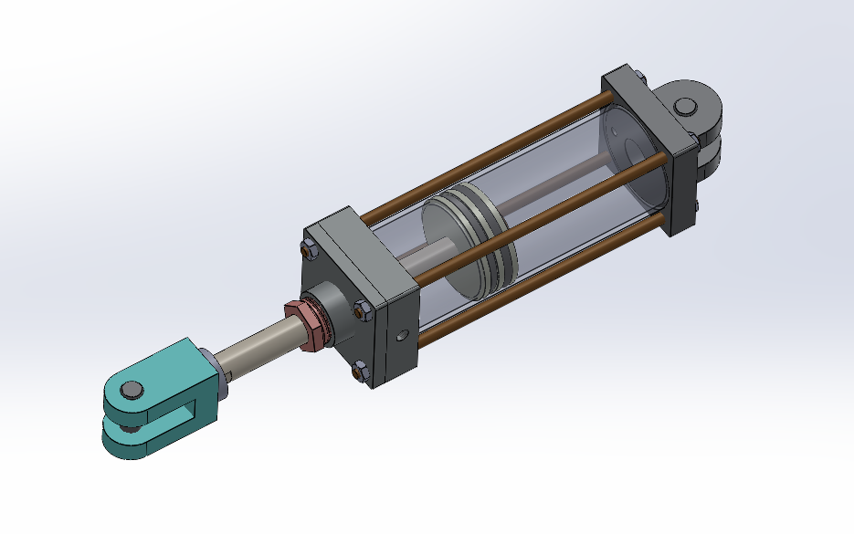
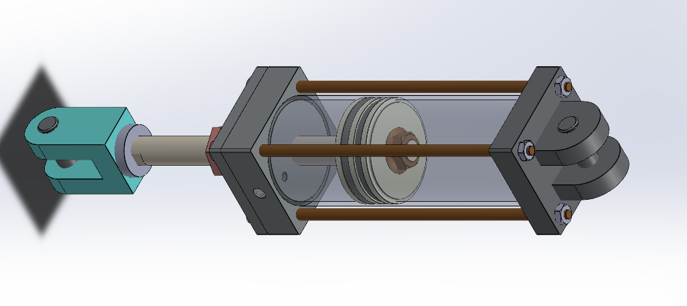
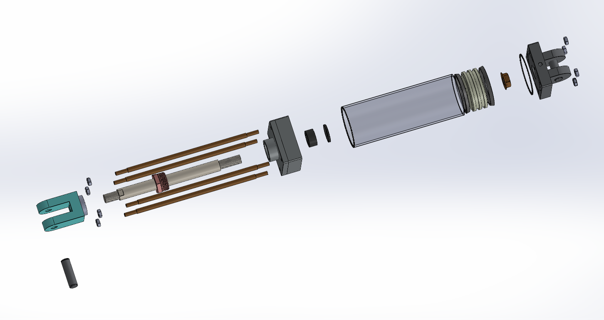

# Assembly-Model-10-SW

# 🛠️ SolidWorks Piston-Cylinder Assembly

This repository contains a 3D mechanical assembly of a **Piston-Cylinder** system designed in **SolidWorks**. The model is suitable for educational demonstrations, animations, mechanical simulations, or integration into more complex CAD systems.

## 📽️ Preview

Watch a short preview of the assembled model in motion on YouTube:  
👉 [Watch Preview](https://youtube.com/shorts/d31MPBmZ2QU?si=HEIt6cYPEaTnKtIw)

## 📂 Contents

- `Piston.SLDPRT` – SolidWorks part file for the piston  

- `Cylinder.SLDPRT` – SolidWorks part file for the cylinder 
 
- `Piston_Assembly.SLDASM` – Full assembly of the piston-cylinder system  

- `Render/` – Optional renders or screenshots of the model  

- `Docs/` – Any documentation or design notes (optional)

## 💡 Features

- Fully constrained piston-cylinder assembly  

- Smooth animation-ready design  

- Cleanly organized part structure  

- Educational use-case ready

## Author

Nishchay Sharma

>B.Tech Mechanical Engineering

>Gold Medalist | Design Engineer

## File Include-
- 'project10_nishchay.  SLDPRT' -
solidworks part file

## License
This project is licensed under the MIT license.

### Isometric View-I 

### Isometric View-II

### Exploded View

Thank You for Viewing!