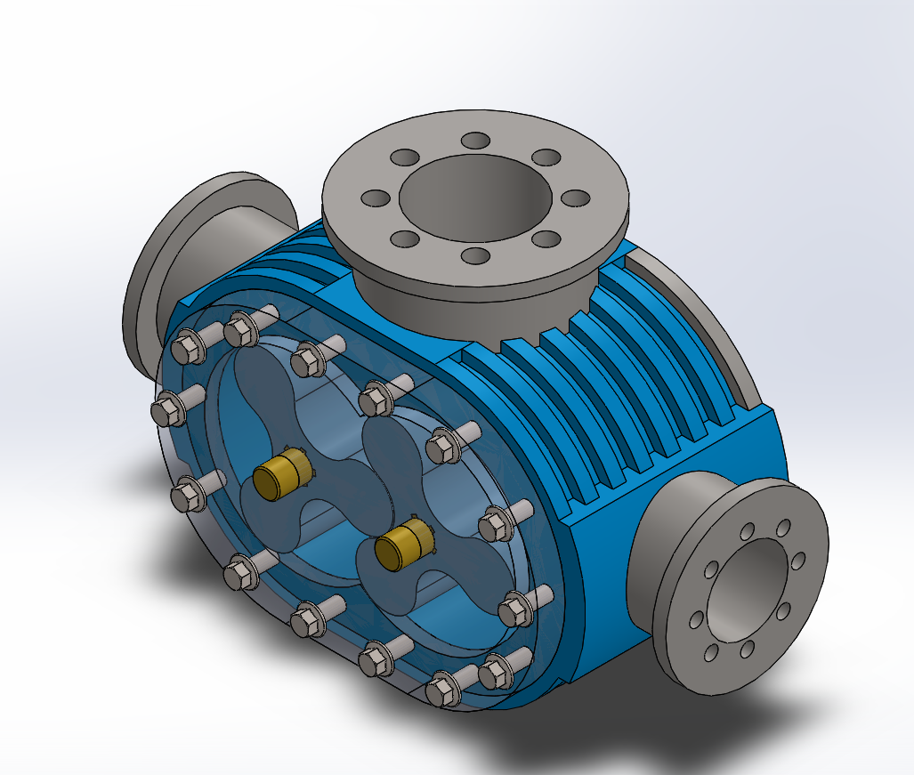
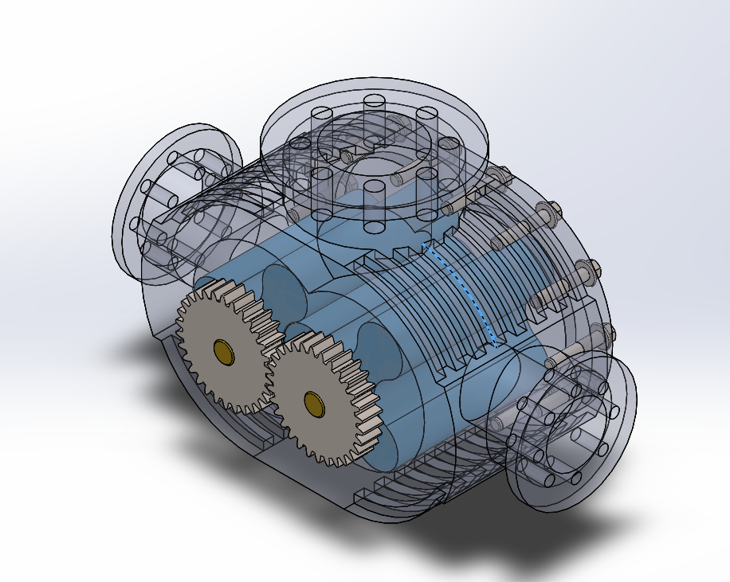
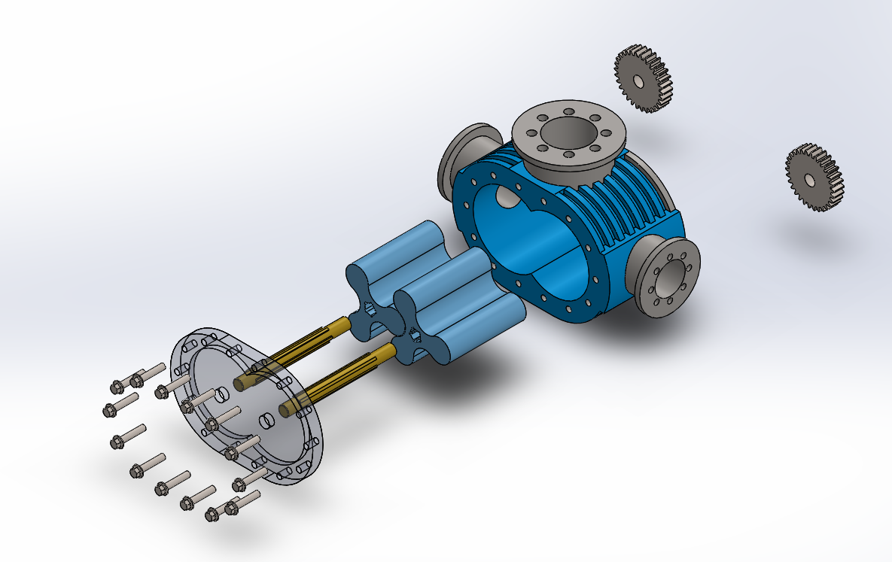

# Assembly-Model-11-SW

# Root Blower Compressor Assembly

This project features the 3D CAD assembly of a *Root Blower Compressor*, a type of positive displacement rotary compressor used for delivering constant volume of air or gas at varying pressures. The model is ideal for educational demonstrations, simulations, and design studies.

## Preview

> *Note:* This video offers a quick look at the complete assembly and rotation of the internal lobes in action.

## Features

- Fully constrained SolidWorks assembly

- Realistic rotor meshing and gear synchronization

- Accurate representation of:

  - Housing

  - Shafts

  - Gears

  - End covers

- Designed for mechanical learning and motion analysis

## Applications

- Air and gas handling in pneumatic systems 
 
- Industrial vacuum and pressure systems  

- Wastewater treatment aeration  

- Material handling systems  

## Tools Used

- *SolidWorks* for part modeling and assembly  

- *Animation/Motion Study* for rotor movement visualization  

- *YouTube* for video hosting and preview  

## Author

Nishchay Sharma

>B.Tech Mechanical Engineering

>Gold Medalist | Design Engineer

## File Include-
- 'project11_nishchay.  SLDPRT' -
solidworks part file

## License
This project is licensed under the MIT license.

### Isometric View-I 

### Isometric View-II

### Exploded View

Thank You for Viewing!