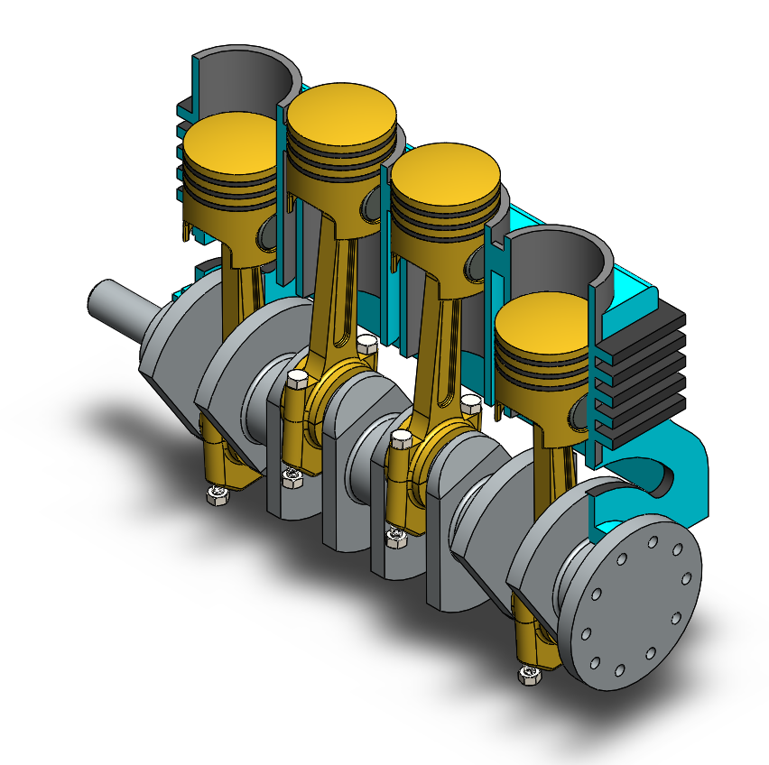
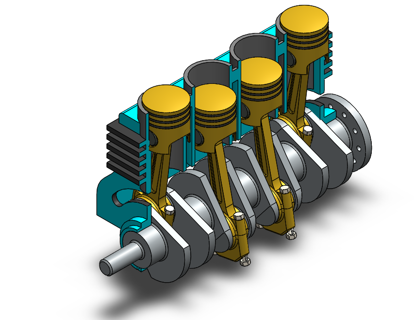

# Assembly-Model-13-SW

# 4 Cylinder Engine Assembly

This project showcases a detailed 3D model and assembly of a *4 Cylinder Engine*, designed using SolidWorks. It demonstrates the internal structure and motion of major components such as the pistons, crankshaft, and camshaft, offering a clear visual representation of engine operation.

## Overview

- *Software Used:* SolidWorks  

- *Project Type:* Mechanical Design & Assembly  

- *Category:* Internal Combustion Engine  

- *Main Components:* Pistons, Connecting Rods, Crankshaft, Cylinder Block, Flywheel  

## Demonstration

Watch the short video demonstration of the engine in motion here:

## Features

- Accurate 4-cylinder inline engine layout

- Fully constrained and animatable parts

- High-performance simulation ready

- Ideal for showcasing engine dynamics and timing

## Applications

This model can be used for:

- Educational demonstrations  

- Engineering portfolio projects  

- SolidWorks motion studies  

- Mechanical simulation references

## Author

Nishchay Sharma

>B.Tech Mechanical Engineering

>Gold Medalist | Design Engineer

## File Include-
- 'project13_nishchay.  SLDPRT' -
solidworks part file

## License
This project is licensed under the MIT license.

### Isometric View-I 

### Isometric View-II

Thank You for Viewing!