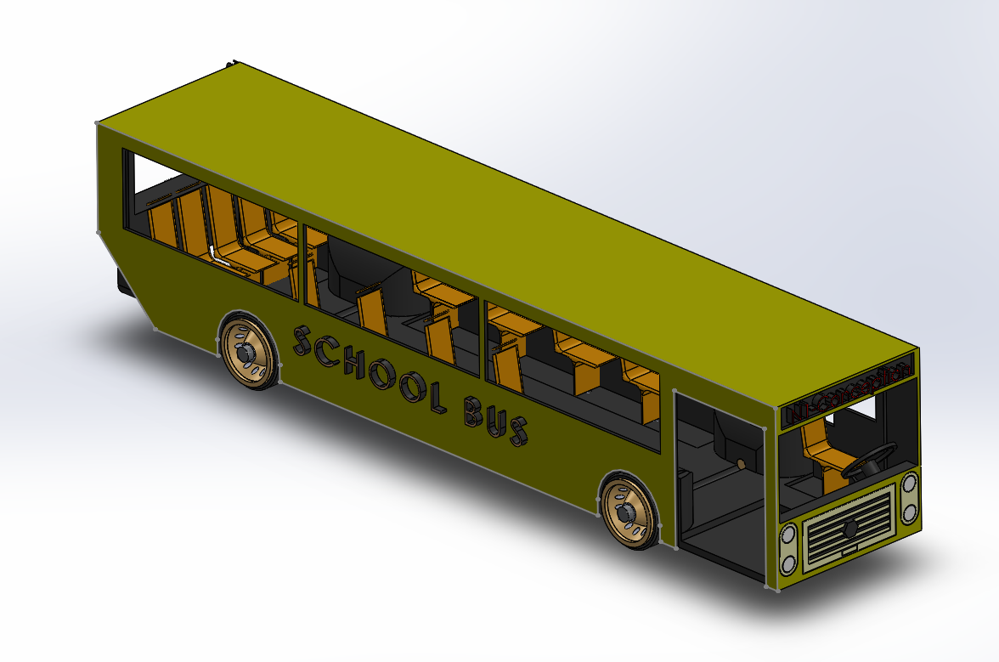
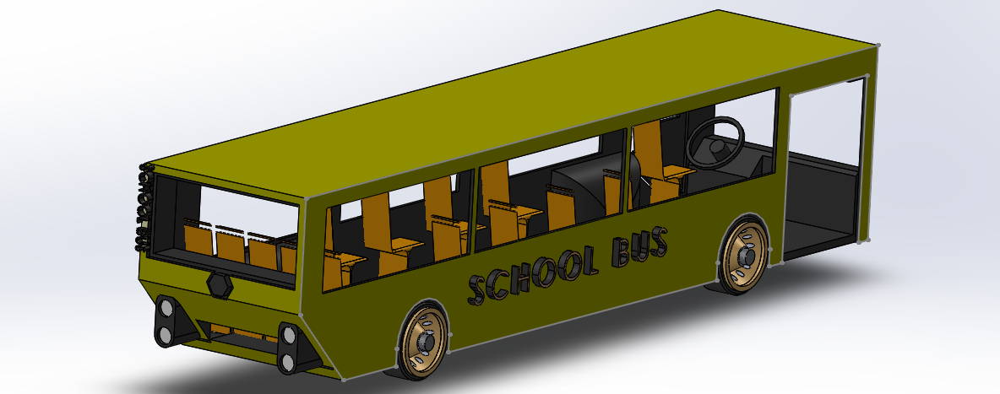
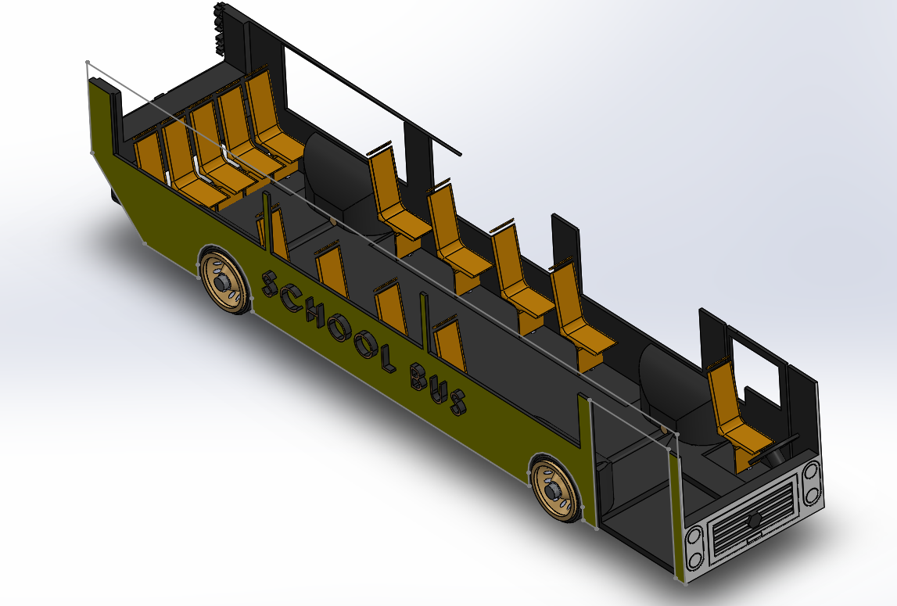

# Assembly-Model-14-SW

##School Toy Bus Assembly – SolidWorks Project

Description

This repository contains the complete 3D Toy School Bus Assembly modeled and assembled in SolidWorks. It is a simplified, colorful, and modular representation of a classic toy bus design, created as part of a design practice project.

Highlights

Designed specifically as a toy version of a school bus

Colorful and child-friendly visual style

Consists of multiple parts: body, wheels, windows, axles, etc.

Demonstrates basic mechanical assembly and mate features in SolidWorks

## Author

Nishchay Sharma

>B.Tech Mechanical Engineering

>Gold Medalist | Design Engineer

## File Include-
- 'project14_nishchay.  SLDPRT' -
solidworks part file

## License
This project is licensed under the MIT license.

### Isometric View-I 

### Isometric View-II

### Section View

Thank You for Viewing!