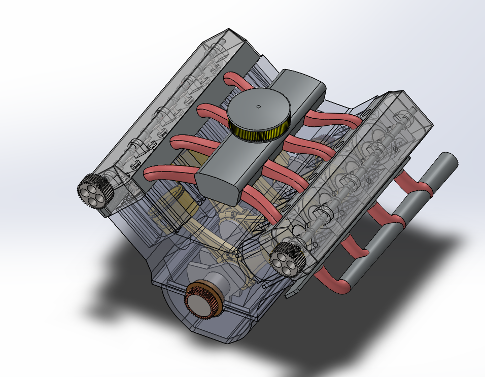
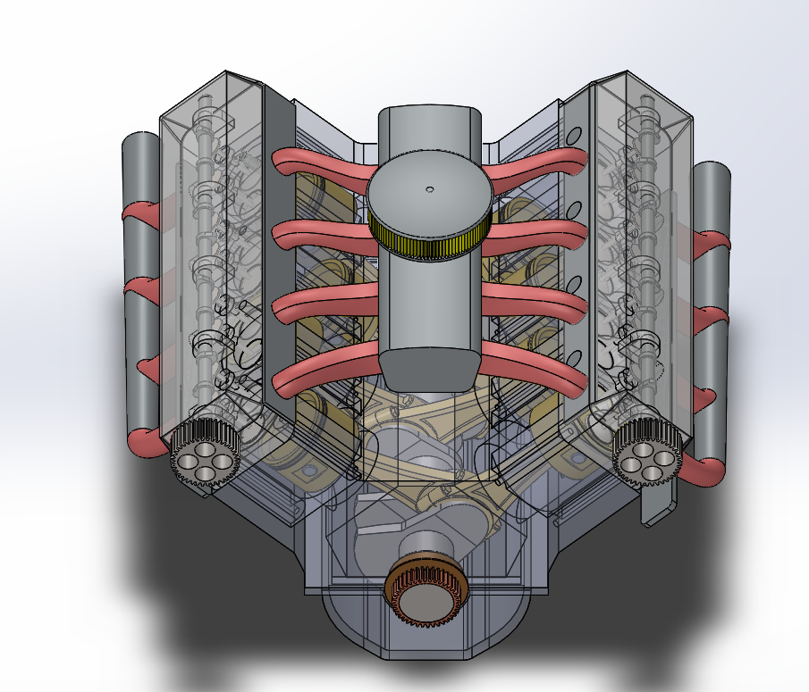
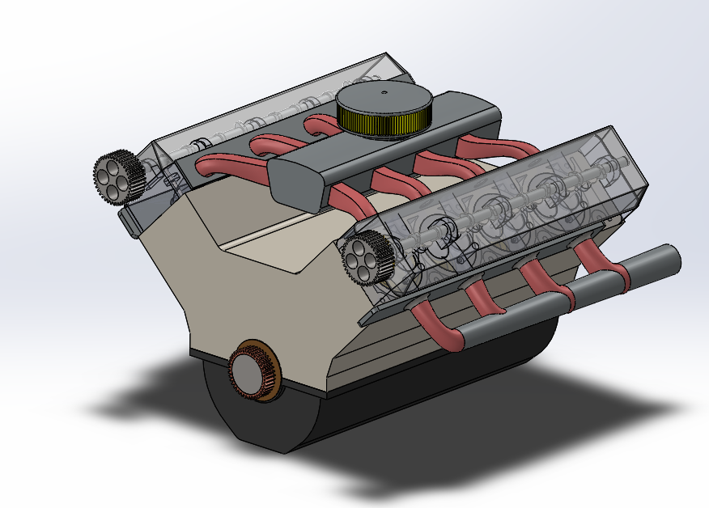
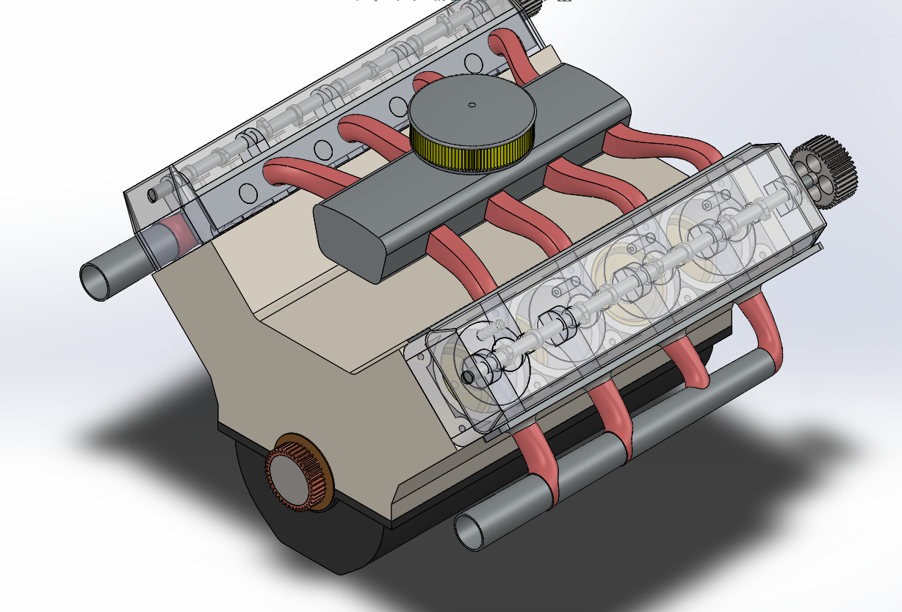
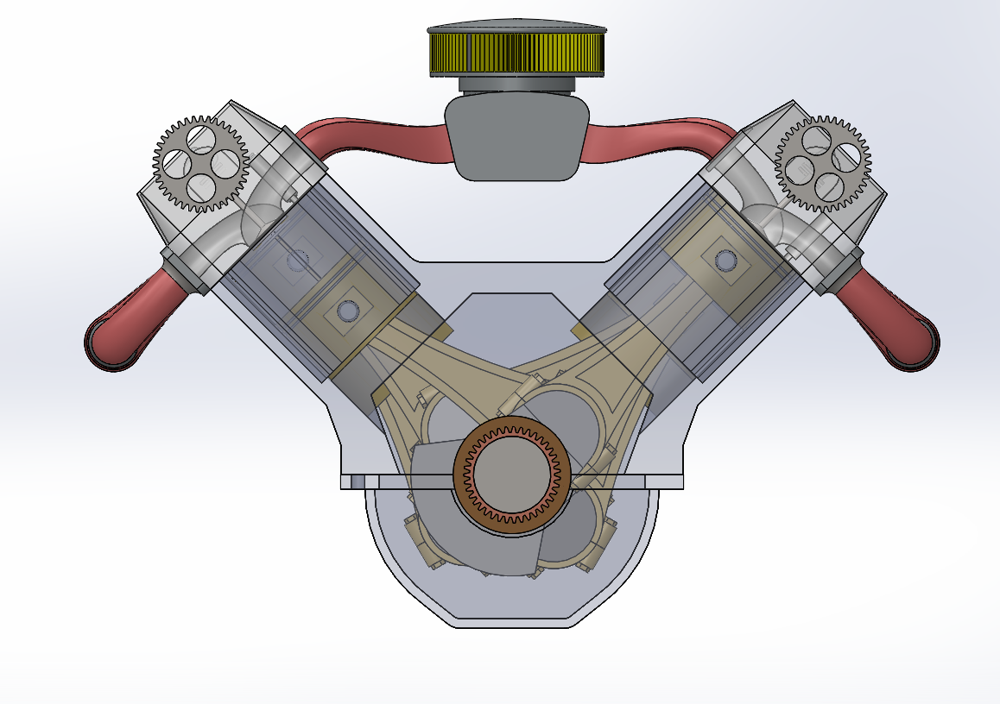

# Assembly-Model-15-SW

# 🏎 V8 Engine CAD Model

This repository contains a detailed 3D CAD model of a V8 Internal Combustion Engine, designed using *SolidWorks*. It showcases the intricate mechanism of a V8 configuration with all major components, including pistons, crankshaft, camshaft, valves, timing gears, and cylinder heads.

## 🧩 Features

- Fully parametric SolidWorks assembly of a *V8 Engine*

- Includes:

  - Pistons & Connecting Rods

  - Crankshaft & Camshaft

  - Cylinder Heads with Valves

  - Timing Gear System

  - Exhaust Manifold and more

- Designed with proper mechanical constraints

- Animation-ready assembly setup

## 🛠 Tools Used

- *CAD Software*: SolidWorks 2022 (Compatible with later versions)

- *Rendering*: SolidWorks Visualize (Optional)

## 💡 Applications

- Mechanical Engineering Portfolios

- CAD Design and 3D Modeling Practice

- Academic Demonstrations & Presentations

- Kinematic and Motion Analysis Projects

- Training Projects in Design Engineering

## Author

Nishchay Sharma

>B.Tech Mechanical Engineering

>Gold Medalist | Design Engineer

## File Include-
- 'project15_nishchay.  SLDPRT' -
solidworks part file

## License
This project is licensed under the MIT license.

### Isometric View-I 

### Isometric View-II

### Isometric View-III

### Isometric View-IV

### Front View

Thank You for Viewing!