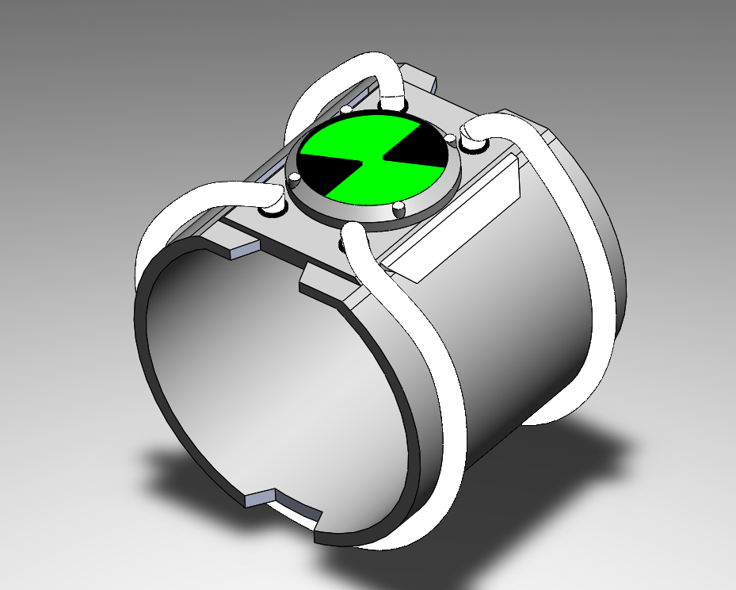
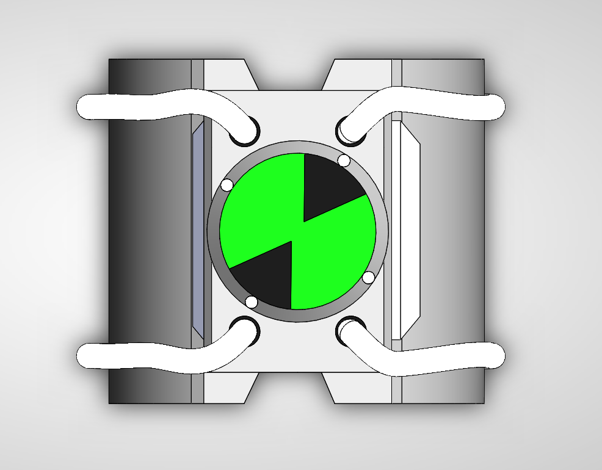

# Assembly-Model-16-SW

# 🛠 Omnitrix 3D Model | SolidWorks Design

This repository features a *fully custom-designed 3D model of the Omnitrix, the iconic alien transformation device from the *Ben 10 series. Modeled precisely using *SolidWorks*, the project combines design creativity and mechanical detailing.

## 🚀 Project Highlights

- ✅ *Software Used*: SolidWorks (Part & Assembly Design)

- 🎯 *Model Type*: Conceptual Design of Omnitrix

- 🌀 *Central Core Detail*: Custom Alien Symbol (Green + Black Spiral)

- 🧩 *Parts*: Cylindrical body, claws/grippers, and top dial plate

- 🧱 *File Type*:  .SLDASM

## 🎨 Features & Design Notes-

- Designed with accurate symmetry and alignment

- Includes aesthetic detailing and color-inspired rendering (green-black)

- Movable parts like claws and dial symbol (conceptual)

- Ideal for animation, 3D printing, or showcasing SolidWorks skills

## 📹 YouTube Video

## Author

Nishchay Sharma

>B.Tech Mechanical Engineering

>Gold Medalist | Design Engineer

## File Include-
- 'project16_nishchay.  SLDPRT' -
solidworks part file

## License
This project is licensed under the MIT license.

### Isometric View 

### Top View 

Thank You for Viewing!