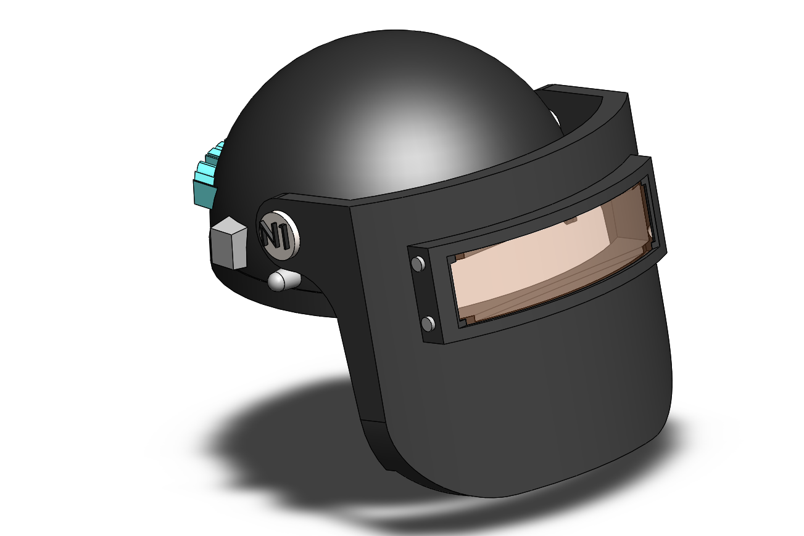
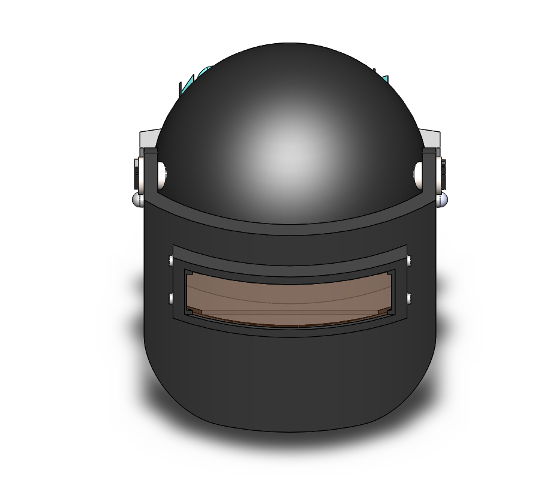

# Assembly-Model-17-SW

# 🛡 BGMI Helmet Assembly | SolidWorks Design by N1 Conception

## 🎮 Project Overview

This project features a meticulously crafted *BGMI Helmet Assembly* – inspired by the iconic protective gear from the Battlegrounds Mobile India universe. Modeled entirely in *SolidWorks*, the helmet captures intricate details, clean contours, and a mechanical flavor that bridges gaming and real-world design.

Whether you're a design enthusiast, mechanical engineer, or gamer, this model blends *engineering precision* with *creative aesthetics*.

---

## 🛠 Tools & Skills Used

- 💻 *Software:* SolidWorks (Part + Assembly Design)

- 🧠 *Skills:* Surface Modelling, Assembly Mates, Realistic Proportions, Gaming-Inspired Aesthetics

- 📐 *Concept:* Based on Level 3 Helmet from BGMI

## Author

Nishchay Sharma

>B.Tech Mechanical Engineering

>Gold Medalist | Design Engineer

## File Include-
- 'project17_nishchay.  SLDPRT' -
solidworks part file

## License
This project is licensed under the MIT license.

### Isometric View-I 

### Isometric View-II 

Thank You for Viewing!