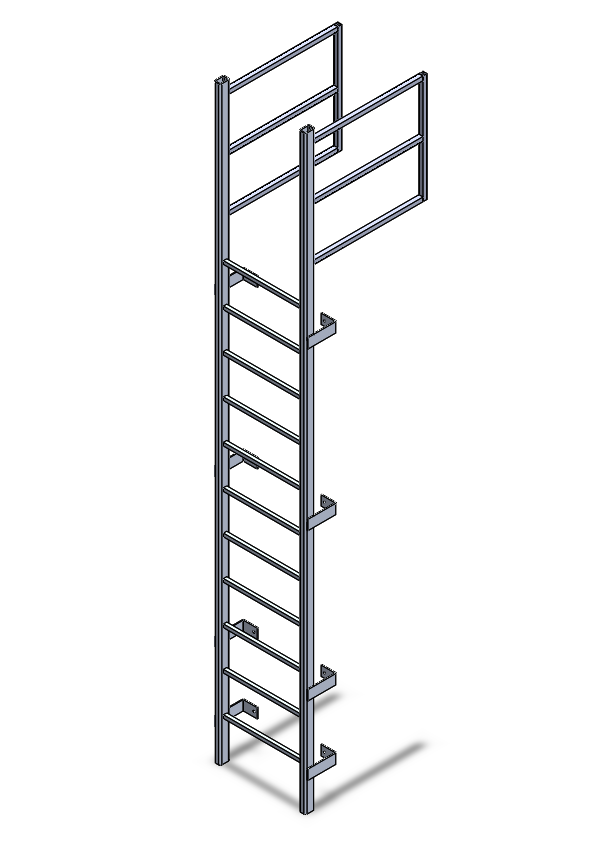

# Assembly-Model-18-SW

# 🪜 Tubular Fixed Ladder – SolidWorks Design Assembly

This repository contains the complete 3D CAD design of a *Tubular Fixed Ladder*, developed as part of a skills-based internship assessment. The design includes all part models, full assembly, and a written design approach document.

## 📐 Key Features

- 🔩 Fully parametric SolidWorks models of all ladder components

- 🧱 Structural members created using *Weldments*

- 🧰 Mounting bracket modeled using *Sheet Metal*

- 🧲 Realistic assembly with correct mates and spacing

---

## 📎 Tools & Technologies

- ✅ SolidWorks 2023 (fully compatible with earlier versions)

- 🛠 Weldments, Sheet Metal, Assembly Mates, Linear Pattern,

- 💾 Exported PDF for easy preview of final drawing

---

## 📌 Notes

- The *walk-thru handrails* were intentionally excluded from the final model due to profile limitations.

- All profiles, materials, and sizes are aligned to the original drawing as closely as possible, with justifiable assumptions where necessary.

---

## Author

Nishchay Sharma

>B.Tech Mechanical Engineering

>Gold Medalist | Design Engineer

## File Include-
- 'project18_nishchay.  SLDPRT' -
solidworks part file

## License
This project is licensed under the MIT license.

### Isometric View 

Thank You for Viewing!