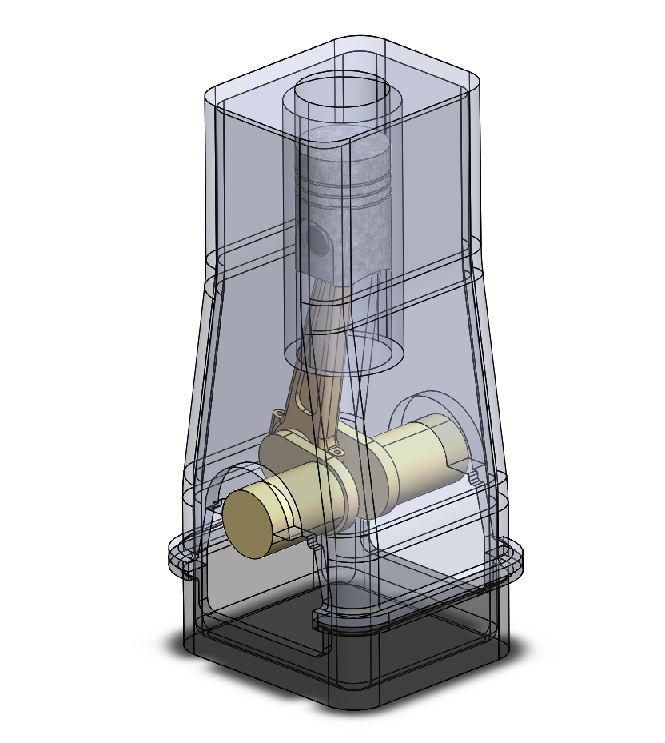

# Assembly-Model-19-SW

# 🛠️ Single Cylinder IC Engine (SolidWorks Design)

This project features a detailed **3D CAD model** of a **Single Cylinder Internal Combustion (IC) Engine**, created using **SolidWorks**. It includes all major components modeled as per standard mechanical design principles and assembled to simulate the engine's real-world functionality.

---

## 🧩 Key Components

- **Cylinder**: Houses the piston and provides the combustion chamber.

- **Piston**: Reciprocating component that transmits force via connecting rod.

- **Connecting Rod**: Connects piston to crankshaft.

- **Crankshaft**: Converts reciprocating motion into rotational.

- **Valves**: Intake and exhaust for air-fuel mixture and combustion gases.

- **Flywheel**: Maintains inertia and smooth engine rotation.

---

## ⚙️ Design Tools

- **Software Used**: SolidWorks 2022 (or later)

- **Units**: Millimeters (mmgs)

- **Modelling Techniques**:

  - Boss/Base Extrudes

  - Revolves

  - Cuts & Fillets

  - Assembly Mates (Concentric, Coincident, Angle)

  - Motion Study 

## 🎯 Applications

- Academic Projects

- Design Demonstrations

- Training and Internships

---

## 📌 Note

This project is for educational and demonstration purposes. All parts are designed with assumed standard dimensions unless otherwise stated.

---

## 📜 License

This project is licensed under the [MIT License](LICENSE).

---

## Author

Nishchay Sharma

>B.Tech Mechanical Engineering

>Gold Medalist | Design Engineer

## File Include-
- 'project19_nishchay.  SLDPRT' -
solidworks part file

## License
This project is licensed under the MIT license.

### Isometric View-I 

Thank You for Viewing!