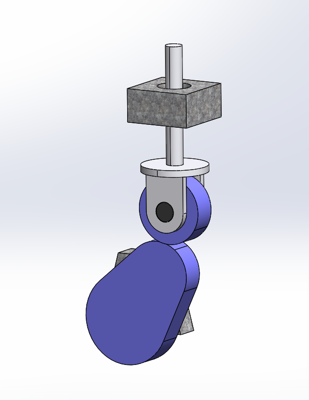

# Assembly-Model-20-SW

# Cam Follower – Simple Assembly (SolidWorks)

This repository contains the **Cam Follower Simple Assembly** designed in SolidWorks.
  
The project demonstrates the working principle of a **Cam and Follower mechanism**, widely used in engines, automation systems, and machinery for precise motion transfer.

---

## 🔧 Features
- Simple yet effective **Cam and Follower mechanism**.

- Designed using **SolidWorks Assembly tools**.

- Demonstrates **relative motion** between the cam and the follower.

- Can be used as a **learning project** for beginners in design engineering.

---

---

## 🚀 Applications
- Used in **internal combustion engines** (valve timing mechanisms). 
 
- **Automation equipment** where controlled motion is required.  

- Educational demonstration of **kinematic pairs**.  

---

## 📌 About
Created as part of my SolidWorks learning journey under **N1 Conception**.  
📍 Owner: **Nishchay Sharma – N1 Conception**  

---

## ⭐ Support
If you like this project, consider **starring the repo ⭐** and  
subscribe to my YouTube channel 👉 [N1 Conception](https://www.youtube.com/@n1conception)  
for more SolidWorks design projects!

## Author

Nishchay Sharma

>B.Tech Mechanical Engineering

>Gold Medalist | Design Engineer

## File Include-
- 'project20_nishchay.  SLDPRT' -
solidworks part file

## License
This project is licensed under the MIT license.

### Isometric View-I 

Thank You for Viewing!