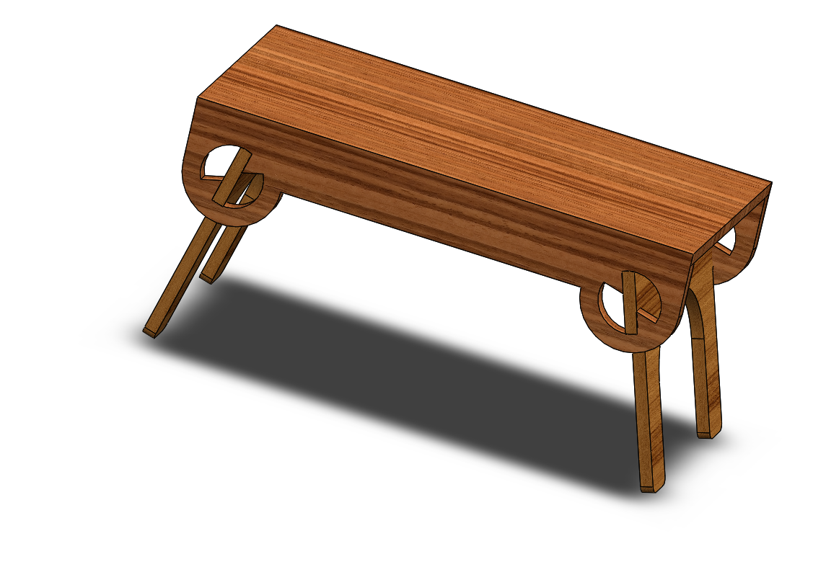

# Assembly-Model-20-SW

# 🛠️ Foldable Table | SolidWorks Design

This repository contains the **3D model and assembly** of a **Foldable Table** designed in **SolidWorks**.  

The project demonstrates skills in **part modeling, assemblies, mates, and motion study**.

---

## 📂 Project Structure

  
- **/Assembly** → Complete foldable table assembly file.  

- **/Renders** → High-quality images of the model.  

- **/Drawings** → Technical 2D drawings with annotations.  

---

## ✨ Features

- ✔️ Compact and foldable design for easy storage.  

- ✔️ Realistic assembly with hinge and locking mechanisms.  

- ✔️ Optimized for manufacturability and practical use.  

- ✔️ Motion simulation to demonstrate folding/unfolding.  

---

## 🧩 Skills Demonstrated

- SolidWorks **3D Part Modeling**  

- **Assembly with Mechanical Mates**  

- **Motion Study & Simulation**  

- **Design for Functionality and Ergonomics**  

-

---

## 📌 About
Created as part of my SolidWorks learning journey under **N1 Conception**.  
📍 Owner: **Nishchay Sharma – N1 Conception**  

--

## Author

Nishchay Sharma

>B.Tech Mechanical Engineering

>Gold Medalist | Design Engineer

## File Include-
- 'project21_nishchay.  SLDPRT' -
solidworks part file

## License
This project is licensed under the MIT license.

### Isometric View-I 

Thank You for Viewing!